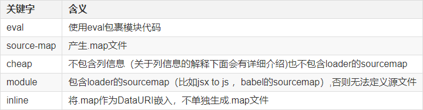

### 配置eslint插件
- 安装`eslint`插件
- 配置工作区`.vscode/settings.json`文件

```json
{
    "eslint.validate": [
        "javascript",
        "javascriptreact",
        "typescript",
        "typescriptreact"
    ],
    "editor.codeActionsOnSave": {
        "source.fixAll.eslint": true 
    }
}
```

### `sourcemap`
> `sourcemap`是为了解决开发代码与实际运行代码不一致时，帮助我们`debug`到原始开发代码的技术

#### 关键字
- 看似`sourcemap`配置项很多，其实只有五个关键字`eval`、`source-map`、`cheap`、`module`、`inline`的任意组合
- 关键字可以任意组合，但是有顺序要求



#### 组合规则
- `[inline-|hidden-|eval-][nosources-][cheap-[module-]]source-map`
- `source-map`单独在外部生成完整的`sourcemap`文件，并且在目标文件里建立关联，能提示错误代码的准确原始位置
- `inline-source-map`以`base64`格式内联在打包后的文件中，内联构建速度更快，也能提示错误代码的准确原始位置
- `hidden-source-map`会在外部生成`sourcemap`文件，但是在目标文件里没有建立关联，不能提示错误代码的准确原始位置
- `eval-source-map`会为每一个模块生成一个单独的`sourcemap`文件进行内联，并使用`eval`执行
- `nosources-source-map`也会在外部生成`sourcemap`文件，能找到源始代码位置，但源代码内容为空（就离谱）
- `cheap-source-map`外部生成`sourcemap`文件,不包含列信息和`loader`的`map`
- `cheap-module-source-map`外部生成`sourcemap`文件,不包含列的信息但包含`loader`的`map`

#### 最佳实践
- 开发环境（对`sourcemap`的要求是：速度快，调试更友好）
  - 要想速度快，推荐：`eval-cheap-source-map`
  - 如果想调试更友好，使用：`cheap-module-source-map`
  - 折中的选择，就是：`eval-source-map`
- 生产环境
  - 首先排除内联，因为一方面我们需要隐藏源代码，另一方面要减少文件的体积
  - 想要调试友好，选择：`sourcemap > cheap-source-map/cheap-module-source-map > hidden-source-map/nosources-sourcemap`
  - 要想速度快，优先选择：`cheap`
  - 折中的选择，就是：`hidden-source-map`